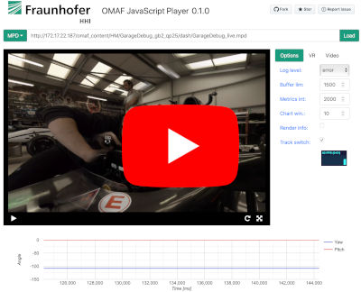
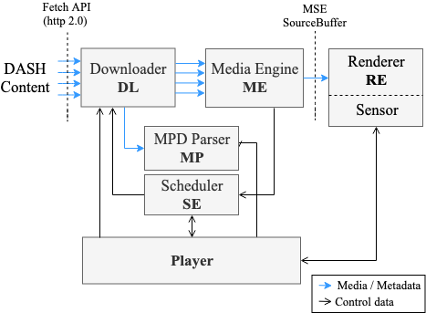
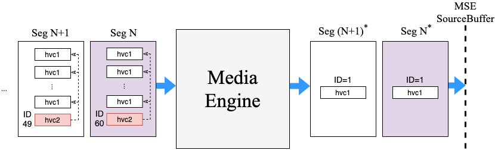
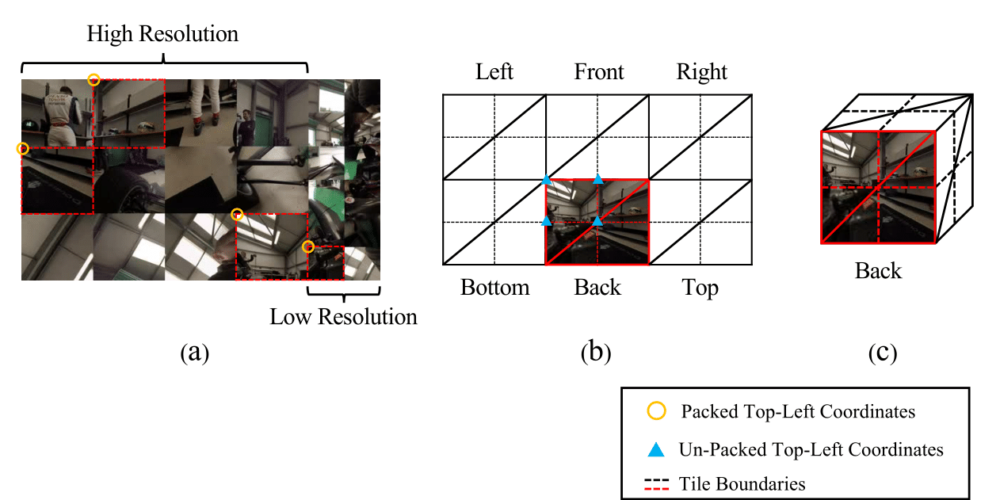

# HTML5 MSE Playback of MPEG 360 VR Tiled Streaming

## Overview

ISO/IEC 23090-2 Omnidirectional Media Format (OMAF) is a systems standard developed by MPEG that aims at standardizing the storage and delivery format for 360-degree multimedia content. Besides many different features, OMAF defines **HEVC-based viewport-dependent media profile** for video which allows to stream HEVC tiles of different resolutions and finally combine them into a single bitstream so that only one video is decoded on the client’s end-device. This approach can be referred to as tile-based streaming, allowing us to increase the resolution within the viewport while decoding a lower resolution video compared to traditional 360-degree video streaming approaches.

This repository contains the **proof-of-concept** implementation of the most advanced media profile from MPEG-OMAF: **HEVC-based viewport-dependent OMAF video profile** with multi-resolution HEVC-tiles, and consits of:

1. JavaScript Player *(source code)*
2. Content Creation Tools `omaf-file-creation` *(python script + binaries)*
3. Test Content *(mp4 files + DASH mpd)*

Further information about the individual modules can be found below.

This implementation was also submitted to the demo track of ACM Multimedia Systems Conference [ACM MMSys'19](http://www.mmsys2019.org/participation/demo-track/) and has been accepted to
appear in the conference. The submitted version of the paper (not camera ready yet) can be downloaded [here](https://arxiv.org/pdf/1903.02971.pdf). Please cite our paper if you use something from this repository:

    @inproceedings{Podborski:2019:HMP:3304109.3323835,
        author = {Podborski, Dimitri and Son, Jangwoo and Bhullar, Gurdeep Singh and Skupin, Robert and Sanchez, Yago and Hellge, Cornelius and Schierl, Thomas},
        title = {HTML5 MSE Playback of MPEG 360 VR Tiled Streaming: JavaScript Implementation of MPEG-OMAF Viewport-dependent Video Profile with HEVC Tiles},
        booktitle = {Proceedings of the 10th ACM Multimedia Systems Conference},
        series = {MMSys '19},
        year = {2019},
        isbn = {978-1-4503-6297-9},
        location = {Amherst, Massachusetts},
        pages = {324--327},
        numpages = {4},
        url = {http://doi.acm.org/10.1145/3304109.3323835},
        doi = {10.1145/3304109.3323835},
        acmid = {3323835},
        publisher = {ACM},
        address = {New York, NY, USA},
        keywords = {360 video, HEVC, JavaScript, MSE, OMAF, VR, streaming, tiles},
    }

To see the JavaScript Player in action you can watch our MMSys demo video here:

We ask everyone who is interested in OMAF to test the implementation and report issues if you find things which can be improved.

Thank you!

## Features

Software in this repository implements a subset of current OMAF version 1 standard, including the following main features:

### File Creation for HEVC-based viewport-dependent OMAF video profile with MCTS (HEVC Tiles)

* Supported codecs:
  * [HM reference encoder](https://hevc.hhi.fraunhofer.de/svn/svn_HEVCSoftware/) (single QP only)
  * [Kvazaar](https://github.com/ultravideo/kvazaar)
  * [HHI live encoder](https://www.hhi.fraunhofer.de/en/departments/vca/technologies-and-solutions/hevc-software-and-hardware-solutions.html)
* Files inlude OMAF metadata such as:
  * Projection format (currently only Cubemap is supported)
  * Region-wise Packing (RWPK)
  * Content Coverage (CC)
  * Spherical region-wise quality ranking (SRQR)
* Creation of a single OMAF mp4 file with 72 video tracks for local playback (no streaming)
* Creation of DASH manifests (MPD) and media segments for streaming:
  * `urn:mpeg:dash:profile:isoff-live:2011` static MPD with *SegmentTemplate*
  * `urn:mpeg:dash:profile:isoff-on-demand:2011` static MPD with *sidx*
  * Preselection Descriptor for *extractor track* Adaptation Sets
* Support for guardbands
* Supported platforms:
  * macOS
  * linux
* More details for file creation can be found [here](./omaf-file-creation/README.md)

### JavaScript Player for HEVC-based viewport-dependent OMAF video profile with MCTS (HEVC Tiles)

* Fully tested on Safari 12.02 (macOS)
* Microsoft Edge browser has an issue with the current implementation due to [this MS Edge issue](https://developer.microsoft.com/en-us/microsoft-edge/platform/issues/11147314). In a nutshell:
  * MSE on Edge needs several seconds of content to start playback (not possible to decode just one short segment)
  * The player has to prepare several seconds of buffer every time when track is changed
  * Therefore, the player implementation in this branch is only playing a single track
* Viewport-dependent streaming for static DASH MPD with *SegmentTemplate*
* HTML5 video element with MSE is used for decoding of the media segments
  * JavaScript repackaging to a single *hvc1* track for MSE
* Rendering using webGL and [three.js](https://github.com/mrdoob/three.js/)
  * Cubemap projection
  * Equirectangular projection
  * RWPK (tested with [HHI content creation tools](./omaf-file-creation/README.md) and [Nokia OMAF Creator](https://github.com/nokiatech/omaf))
* SRQR is supported to the extent needed for tile-based streaming
* DASH Preselection descriptor is used to determine the depencencies between Adaptation Sets
* `'rwpk'` box is used to correctly render the video texture of the corresponding *extractor track*
* Controlling of the buffer size
* UI controls for Play / Pause / Load next MPD / toggle fullscreen mode / zoom
* Rendering of debug information such as:
  * Cube boundaries
  * SRQR high quality region vectors
* Plot data with [google charts API](https://developers.google.com/chart/)

## 1. JavaScript Player documentation

The JavaScript player implementation was tested on Safari browser with support of HEVC video through HTML5 Media Source Extensions API. In addition, the WebGL API is used for rendering, using region-wise packing metadata defined in OMAF.

A general overview of the main components involved in our implementation is depicted in the following figure. It consists of six main modules which interact with each other and together provide a fully functional player for OMAF  360-degree video. Those modules are: **Player**, Downloader (**DL**), MPD Parser (**MP**), Scheduler (**SE**), Media Engine (**ME**) and finally the Renderer (**RE**).

**Player** module represents the core of the entire application. It connects all modules with each other and controls them. **DL** module deals with all HTTP requests to the server. **MP** implements the parsing of the DASH manifest file (MPD) together with additional metadata defined in OMAF. **SE** is controlling the DL module and decides when requests for the next segments should be executed, based on current status of the player. The task of **ME** is to parse OMAF related metadata on the file format level and repackage the downloaded OMAF content in such a way that Media Source Extensions API of the browser can process the data. Finally, the **RE** module is using the OMAF metadata in order to correctly render the video texture on the canvas using WebGL API and a [three.js](https://github.com/mrdoob/three.js/) library.

### Repackaging

Media Engine is taking input from the DL module and prepares the downloaded media segments for the consumption by the Media Source Extension (MSE). Nowadays, the MSE does not yet support OMAF media segments and therefore the downloaded media segment data needs to be repackaged in a format which is understood by the MSE. For the parsing and writing of mp4 format data we are using the JavaScript version of GPAC’s MP4Box tool [mp4box.js](https://github.com/gpac/mp4box.js/). The figure below visualizes the repackaging process and shows the flow of downloaded media segments through the ME module to the MSE SourceBuffer.

Before ME processes the segments each of the segments consist of multiple *hvc1* video tracks (one track for each HEVC tile) and one additional *hvc2* video track with HEVC extractor NAL Units (defined in **ISO/IEC 14496-15**). The extractor track is required for the creation of the single HEVC bitstream in order to be able to use a single decoder instance. An extractor represents the in-stream data structure using a NAL unit header for extraction of data from other tracks and can be logically seen as a pointer to data located somewhere else. Unfortunately, currently available web browsers do not support extractor tracks and thus the repackaging step performed by ME is required. Therefore, ME resolves all Extractors within an extractor track and packages the resolved bitstream into a new track with the same track ID, even if extractor track ID changes. Hence, for the MSE SourceBuffer it always looks like the segments are coming from the same video source even if the player selects completely different tiling configurations.

### Rendering

After the repackaged segment is processed by the MSE SourceBuffer, the browser decodes the video and the video texture is rendered by the RE module using OMAF region-wise packing metadata. Rendering module is using a fragment shader to unpack the regions. The figure below visualizes the rendering process based on an example of a CMP video with 12 high-quality tiles and 12 low-quality tiles:

The 48 triangular surfaces of the cube as depicted in figure (c) can be represented as a 2D plane like in figure (b). The RE uses OMAF metadata to render the resolved image correctly at the cube faces as shown in figure (b). The Region-wise Packing (RWPK) in the OMAF metadata has top-left packed and unpacked coordinates, width, height and rotation value of tiles for all tracks. Since the position and size of the cube faces are always the same, the image in figure (b) can be assumed to be an unpacked image. Therefore, the RE sets the rendering range of the figure (a) using the RWPK metadata, and renders the tiles of the resolved image to the cube faces of the figure (b). However, when there is a change in the viewport position, the RE has to set different metadata for the corresponding track. In the implementation, when the manifest file is loaded, the RE module is initialized with all RWPK metadata to be prepared for all tracks.

## 2. Content Creation Tools (OMAF Generator)

This project also includes tools for generation of OMAF files which were used for testing of the player implementation. Tools are located in `omaf-file-creation` directory where you can also find a [documentation file](./omaf-file-creation/README.md) with a detailed description of the usage.
The binaries for content creation tools are available for macOS and linux.
> NOTE: The content creation tools provided in this repository are for testing purposes only and are not suitable for live streaming use cases. For more information on live streaming solutions please contact us.

## 3. Test Content

One short encoded and packaged video sequence is also provided for testing. Thanks to Ericsson for permission to publish the data in OMAF form.
The test sequence is available for download at our [datacloud server](https://datacloud.hhi.fraunhofer.de/nextcloud/s/38tHKMQTogibTKM) with all the content zipped into a single `Garage.zip` file. 

It contains a `dash` folder with a DASH manifest file and media segments available in 2 different resolutions (each encoded with 3 different quality levels) which can be used together with the JavaScript player.
In addition, it includes a single `Garage_qp27.mp4` file with 72 video tracks (24 high resolution tiles, 24 low resolution tiles and 24 extractor tracks) which can be used for local playback testing using stand-alone tools such as [hevc_extractors app](https://github.com/podborski/isobmff/tree/extractorFix).

In case of any problems with the datacloud link please contact: dimitri.podborski@hhi.fraunhofer.de

## 4. Usage Guidelines

The player implementation is a web page with html, js, css files and therefore can be simply uploaded to your HTTP Server.

> NOTE: `omaf-file-creation` folder is not required and should be omitted.

OMAF media segments also have to be uploaded to your web distribution together with DASH manifest files.

In order to simplify the usage you can add your DASH manifest URLs to the `manifests.json` file. For example:

    {
      "name": "Some description text",
      "url": "https://.../content/dash/GarageDebug_live.mpd"
    }

## 5. Getting started on macOS

Here are some really simple guidelines to get it running locally (localhost streaming).

Install HTTP Server, for example `nginx`:

    brew install nginx

Let's download all data first. Let's say the root directory of our HTTP server will be located in  `~/omafserver`. We need to put the JavaScript Player implementation together with OMAF test data there and then configure `nginx` and set the HTTP server root directory to `~/omafserver`. Open your terminal and do this (downloading the content could take some time):

    mkdir ~/omafserver && cd ~/omafserver
    git clone https://github.com/fraunhoferhhi/omaf.js.git
    curl https://datacloud.hhi.fraunhofer.de/nextcloud/s/38tHKMQTogibTKM/download -o content.zip
    unzip -q content.zip

Now everything should be located in `~/omafserver` and we have to configure the HTTP server. By default `nginx` loads all sites defined in `/usr/local/etc/nginx/servers/.`, thus, let us create a simple configuration `omafserver.conf`:

    touch /usr/local/etc/nginx/servers/omafserver.conf
    open -t /usr/local/etc/nginx/servers/omafserver.conf

and add the following contents while replacing `yourUserName` with your user name:

    server {
        listen       5555;
        server_name  omafserver;
        autoindex on;
        root /Users/yourUserName/omafserver;
        location / {
        }
    }

Now you can start the server

    brew services start nginx

And open Safari web browser and go to: `http://127.0.0.1:5555/omaf.js/` which loads the JavaScript player website. Now you can input the URL of the test data MPD in the top field `http://127.0.0.1:5555/OMAFBrowserData/Garage/dash/Garage_live.mpd` and click on load button.
After MPD is loaded and the player is initialized you can click on play button to start the streaming session.

## 6. License

Please see [LICENSE.txt](./LICENSE.txt) file for the terms of use of the contents of this repository.

For more information, please contact: omaf@hhi.fraunhofer.de

**Copyright (c) 1995-2019 Fraunhofer-Gesellschaft zur Förderung der angewandten Forschung e.V.**

**All rights reserved.**