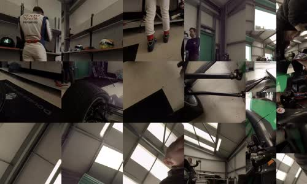
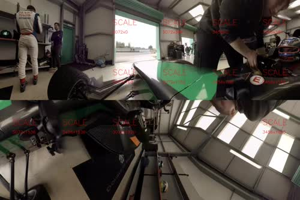

# OMAF File Creation tools

Provides guidelines for creation of test vectors for HEVC-based viewport-dependent OMAF video profile with MCTS.

In the following it is explained how to create OMAF compliant files from raw (yuv) ERP source video files.

Destination format:

- Projection: CMP
- Number of tiles: 24 (24 high and 24 low res tiles)
  - High resolution tile size: 768x768
  - Low resolution tile size: 384x384
- Number of 'viewport' streams (hvc2 tracks) = 24
  - Each 'viewport' stream consists of: 12 high resolution tiles and 12 low resolution tiles with following packing:

```
+-------+--------+-------+--------+---|---+
|       |        |       |        |   |   |
|       |        |       |        ----|----
|       |        |       |        |   |   |
+-------+--------+-------+--------+---|---+
|       |        |       |        |   |   |
|       |        |       |        |---|----
|       |        |       |        |   |   |
+-------+--------+-------+--------+---|---+
|       |        |       |        |   |   |
|       |        |       |        |---|----
|       |        |       |        |   |   |
+-------+--------+-------+--------+---|---+
```

Decoded (packed) frame:


Rendered (projected) frame:


SRQR regions visualisation:


## Required tools

Following tools are required for this script to work:

- **Python 2.7** with support for following modules (those modules are commonly used and you probably don't need to do anything.)
    1. [argparse](https://docs.python.org/2.7/library/argparse.html)
    2. [subprocess](https://docs.python.org/2.7/library/subprocess.html)
    3. [re](https://docs.python.org/2.7/library/re.html)
    4. [time](https://docs.python.org/2.7/library/time.html)
    5. [os](https://docs.python.org/2.7/library/os.html)
    6. [sys](https://docs.python.org/2.7/library/sys.html)
- **ffmpeg**: Everyone should know what ffmpeg is. Downlolad static build for your OS from [here](https://www.ffmpeg.org/download.html).
- **TAppEncoder**: HM reference encoder. Download source code from [here](https://hevc.hhi.fraunhofer.de/svn/svn_HEVCSoftware/tags/HM-16.19).
- **TApp360Convert**: Projection format conversion tool for 360 video. Download source code from [here](https://jvet.hhi.fraunhofer.de/svn/svn_360Lib/tags/360Lib-5.0). This tool depends on HM software, therefore follow the descriptions in [readme.txt](https://jvet.hhi.fraunhofer.de/svn/svn_360Lib/tags/360Lib-5.0/360Lib-5.0_README.txt) to compile TApp360ConvertStatic together with TAppEncoderStatic.
- **hevc2omaf**: Command line tool for creation of OMAF content.

Compiled static binaries for **TAppEncoder**, **TApp360Convert**, and **hevc2omaf** should be located in ./bin/[linux|osx|win]

Please consider building these tools if they are missing in ./bin/[YourOS]

Also make sure that **ffmpeg** is installed on your system and is set in your `$PATH`

## Description of the script

This script takes as input an ERP projected YUV file and creates the OMAF test vectors in the following 5 steps:

### Step 1: convert ERP yuv to high res CMP yuv

        WARNING: This file is a raw video file with 6k resolution, it will consume a lot of storage.

### Step 2: downlscale highres CMP yuv to additional lowres CMP yuv

### Step 3: split both high and low res files into 24 tiles (each). This creates all required yuv tiles

### Step 4: run HM and encode each tile as MCTS for provided QPs

        WARNING: this process might consume a lot of time since HM reference software is not optimized for speed

### Step 5: package encoded HEVC bitstreams to OMAF files

all the output is written to the output directory specified using `-o` command line argument. Use --help for more information on other arguments.

## Example usage

process 9 frames of Formula3VR_Garage_8192x4096.yuv with single QP 32 and use max 8 threads.

    ./create_omaf_files.py -i Formula3VR_Garage_8192x4096.yuv -f 9 -q 32 -t 8 -c HMconfig.cfg

encode (with QP=24) and package yuv files from 'out/yuv/OutLap' directory

    ./create_omaf_files.py -s 4-5 -i out/yuv/OutLap/ -f 9 -p OutLap -c HMconfig.cfg -q 24

## License

Please see [LICENSE.txt](./LICENSE.txt) file for the terms of use of the contents of this repository.

For more information, please contact: omaf@hhi.fraunhofer.de

**Copyright (c) 1995-2019 Fraunhofer-Gesellschaft zur Förderung der angewandten Forschung e.V.**

**All rights reserved.**